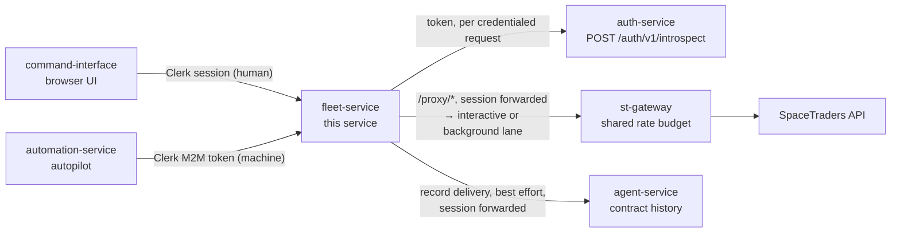
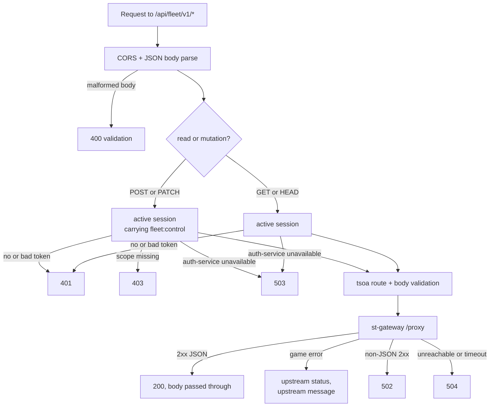
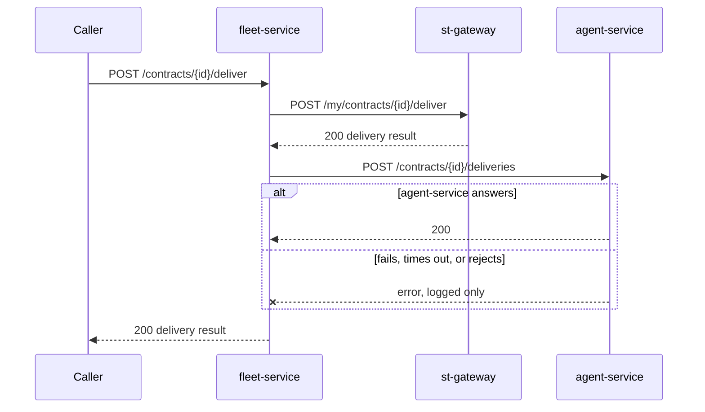

# Fleet Service

**This service holds no credentials and no state.** It is a thin, authenticated
seam between the browser (and the autopilot) and the SpaceTraders game API:
it asks auth-service *who is asking*, then forwards the ship action
through `st-gateway`, which supplies the game credential itself. Everything
else follows from that.

One credential travels on every request:

| Header | What it is | Who checks it |
|---|---|---|
| `Authorization: Bearer <jwt>` | Clerk session — a human operator, or automation-service's machine identity | auth-service, the only verifier (auth-design.md decision 21), which this service asks per request; then forwarded verbatim to st-gateway (queue priority) and, on a contract delivery, to agent-service |

No SpaceTraders token passes through here. st-gateway holds the only copy and
injects it on every upstream call (auth-design.md decision 5), so a stolen
Clerk session is the only thing that could drive the fleet — and it is
short-lived, revocable, and never a game credential. The `X-SpaceTraders-Token`
header of decision 18 is gone; a stale caller still sending it is ignored, not
rejected.

Ship/cargo purchases and cargo sells deliberately live in `agent-service`, not
here — those are the actions that move credits, and agent-service owns the
resulting transaction history.

## Architecture



It stores nothing. There is no database, no cache, no in-memory session — a
restart loses nothing and any number of instances can run behind a load
balancer.

## Request flow

Every API request takes the same path. The only branch is which credential
check applies, and that is decided by the HTTP method alone.



Reads need only a signed-in operator, not a scope: cooldown and cargo are facts
about the one account the fleet plays, so they are not anonymous (decision 3),
but they move nothing. `HEAD` counts as a read because Express answers it from
the `GET` handler.

### Authentication

This service verifies nothing itself. For every request that carries an
`Authorization` header, the shared
[`@v-m-pioneer-trading/introspection-client`](https://github.com/V-M-Pioneer-Trading/ts-introspection-client)
package POSTs the token to auth-service (`AUTH_INTROSPECTION_URL`, caller
secret in `X-Introspection-Secret`, 1 s timeout, no retry, no cache) and
compares the answer with the requirement `src/auth.ts` declares for the method.
The exact behaviour is fixed by `meta/fixtures/introspection.json`:

| Situation | Answer | auth-service called |
|---|---|---|
| No `Authorization`, or one that is not exactly `Bearer <token>` (`Bearer`, `Bearer `, `Bearer abc def`) | `401 a bearer token is required` | no |
| auth-service says the token is inactive | `401 invalid or expired session` | yes |
| Active, mutation, no `fleet:control` | `403 this action requires a scope this session does not carry` | yes |
| auth-service unreachable, slow, non-2xx, malformed, or refusing our secret | `503 the authentication service could not process this request` | yes |

The health routes and Swagger UI are declared `ignoreCredentials()`: their
`Authorization` header is never read and they never call auth-service, so
they answer the same with no header, a bad one, or auth-service down. The
app is wrapped in the package's `secured()`, so a route added without a
declaration refuses to start; the tsoa-generated router cannot carry
declarations, so the guard sits on its mount instead. Fail-closed is
deliberate: with auth-service down every API route here answers `503`, and
there is no fallback to local verification (decision 21).

## Setup

```bash
npm install
npm run build   # tsoa spec/routes into src/generated, then tsc
npm start
```

`npm run dev` is build + start. `npm test` runs the suite. The service listens
on port `3001`; Swagger UI is at http://localhost:3001/api/fleet/swagger.

The service **will not start** without `AUTH_INTROSPECTION_URL` and
`AUTH_INTROSPECTION_SECRET`: it exits naming the missing variable before a port
is bound, rather than coming up healthy and answering `503` to everything.

For Docker: run auth-service locally, export `AUTH_INTROSPECTION_SECRET` to the
value it was started with, and `docker compose up --build`.

### Environment variables

| Variable | Default | Description |
|---|---|---|
| `PORT` | `3001` | HTTP port. Must be a positive integer; the process refuses to start otherwise |
| `ST_GATEWAY_URL` | `http://localhost:3002` | st-gateway base URL; every SpaceTraders call goes to its `/proxy` path |
| `AGENT_SERVICE_URL` | `http://localhost:8080/api/agent/v1` | agent-service base URL, used to record contract deliveries |
| `CORS_ALLOWED_ORIGIN` | `http://localhost:3000` | Frontend origin allowed to call this service |
| `UPSTREAM_TIMEOUT_MS` | `30000` | Deadline for every outbound call. Must be a positive integer |
| `AUTH_INTROSPECTION_URL` | — | **Required.** The full introspection endpoint, used verbatim, e.g. `http://localhost:3005/auth/v1/introspect` in production |
| `AUTH_INTROSPECTION_SECRET` | — | **Required.** Caller secret for that endpoint (SSM `auth-service-introspection-secret`). Never the vault's `AUTH_SERVICE_SHARED_SECRET` |

## API

All routes live under `/api/fleet/v1` and need the `Authorization` header from
the table at the top. Which st-gateway queue the call lands in is derived from
that session by the gateway itself; nothing a caller declares can change it.

| Method | Path | Auth | Body |
|---|---|---|---|
| `POST` | `/ships/{shipSymbol}/orbit` | `fleet:control` | — |
| `POST` | `/ships/{shipSymbol}/dock` | `fleet:control` | — |
| `POST` | `/ships/{shipSymbol}/navigate` | `fleet:control` | `{ waypointSymbol }` |
| `POST` | `/ships/{shipSymbol}/extract` | `fleet:control` | optional `{ survey }` |
| `POST` | `/ships/{shipSymbol}/extract/survey` | `fleet:control` | a `Survey` from `/survey` |
| `POST` | `/ships/{shipSymbol}/survey` | `fleet:control` | — |
| `POST` | `/ships/{shipSymbol}/refuel` | `fleet:control` | optional `{ units?, fromCargo? }` |
| `POST` | `/ships/{shipSymbol}/transfer` | `fleet:control` | `{ shipSymbol, tradeSymbol, units }` |
| `PATCH` | `/ships/{shipSymbol}/nav` | `fleet:control` | `{ flightMode }` — `CRUISE`/`BURN`/`DRIFT`/`STEALTH` |
| `GET` | `/ships/{shipSymbol}/cooldown` | signed-in | — |
| `GET` | `/ships/{shipSymbol}/cargo` | signed-in | — |
| `POST` | `/contracts/{contractId}/deliver` | `fleet:control` | `{ shipSymbol, tradeSymbol, units }` |

`GET /health` and `GET /api/fleet/health` need no auth, ignore any
`Authorization` header, and answer
`{"status":"ok"}` with `Cache-Control: no-store`. Both exist because local
compose hits the bare path while production CloudFront only routes paths
matching its configured pattern.

### Contract delivery

The one route that talks to two upstreams, and the one place a failure is
deliberately swallowed:



The cargo is gone from the ship either way — there is nothing to roll back, and
losing a history row should not report a successful gameplay action as failed.
The cost is stated plainly under known limitations.

### Errors

Every failure answers with the same shape SpaceTraders itself uses, so a caller
has exactly one thing to read:

```json
{ "error": { "message": "Ship is not currently docked." } }
```

Validation failures add `error.fields`.

| Status | Means |
|---|---|
| `400` | Malformed JSON body, missing/invalid header or body field |
| `401` | No usable `Bearer` credential, or one auth-service reports inactive (expired, forged, wrong issuer) |
| `403` | Valid session without `fleet:control` on a mutating route |
| `4xx`/`5xx` from st-gateway | Relayed with its own status and message, and with its `Retry-After` / `X-RateLimit-*` headers. That covers the game's refusals, `429` when the shared rate budget is spent, and `503 SpaceTraders credential not configured` when auth-service holds no agent token |
| `404` | Unknown route |
| `502` | st-gateway answered 2xx with something that is not JSON |
| `504` | st-gateway unreachable, or slower than `UPSTREAM_TIMEOUT_MS` |
| `503` `the authentication service could not process this request` | auth-service could not answer; nothing was attempted |
| `500` | A genuine fault here — logged with a stack; nothing else returns it |

The relayed row is st-gateway's verdict, not this service's. It is the only party
that talked to SpaceTraders and the only one that can see whether a credential
exists, so re-deciding its answer here would be a guess overwriting a fact. The
rule and its conformance cases are
[specified in meta](https://github.com/V-M-Pioneer-Trading/meta/blob/main/docs/design/upstream-errors.md);
this service was already closest to it, and what it was still dropping were the
pacing headers the gateway forwards so a caller can back off.

A `401` never says *why* (expired vs. bad signature vs. wrong issuer), and a
`403` never names the scope: the first is a probing oracle, the second
advertises what to steal.

## Tests

```bash
npm test
```

No test signs a token. Controller suites use the package's real Express
adapter over an in-process stub center (they mock `global.fetch` for st-gateway
and agent-service, which the package's own center call also goes through).
`introspectionWiring.test.ts` leaves `fetch` alone and runs against real local
HTTP stubs of auth-service, st-gateway and agent-service: public routes, the
per-method requirement, `HEAD`, the `503`, the bearer-parsing rule, and where
the caller's credential is sent. Nothing reaches beyond localhost.

## Known limitations

Deliberate, and worth knowing before you file a bug:

- **A failed delivery record is lost forever.** No retry, no outbox, no queue —
  just a `console.error`. Contract history in agent-service can silently drift
  from what actually happened in the game.
- **The delivery record is authenticated only once agent-service enforces it.**
  fleet-service forwards the caller's `Authorization` verbatim on that call
  (meta#80 step 5); agent-service starts requiring `fleet:control` there in
  step 6. Until then the route stays open, which is meta#71.
- **No retries anywhere.** A single failed upstream call fails the request.
  Rate limiting and back-off are st-gateway's job by design; transient network
  faults are the caller's problem.
- **Response bodies are passed through untyped.** `src/spacetraders/types.ts`
  models request bodies only; every response is `Record<string, unknown>`, so
  an upstream schema change reaches the frontend unannounced.
- **Swagger UI is unauthenticated.** The API shape is public to anyone who can
  reach the service. There are no secrets in it, but it is not access-gated.
- **auth-service is on the hot path.** One localhost call per credentialed
  request, and a `503` on every API route while it is down or deploying.
- **No structured logging, metrics, or tracing.** Failures reach stdout as
  `console.error` and nothing aggregates them.
- **One CORS origin.** A single string, not a list — no second frontend, no
  preview deploys.
